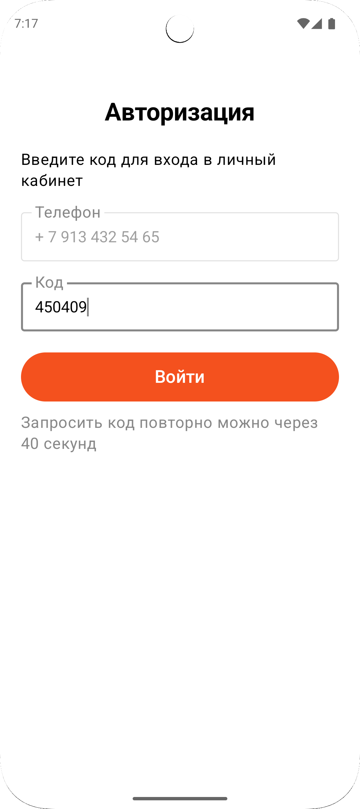
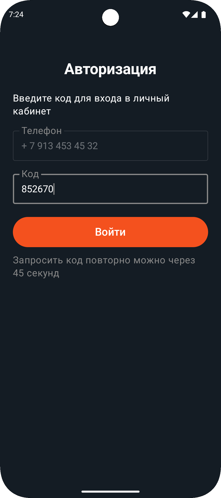
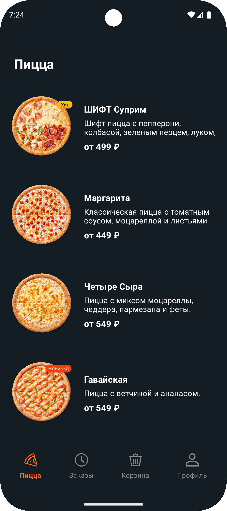
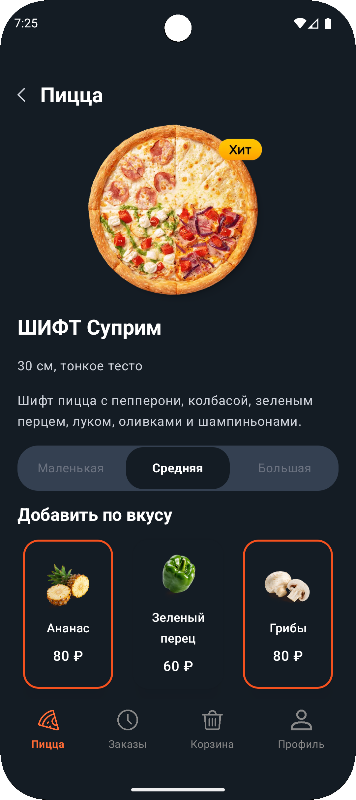
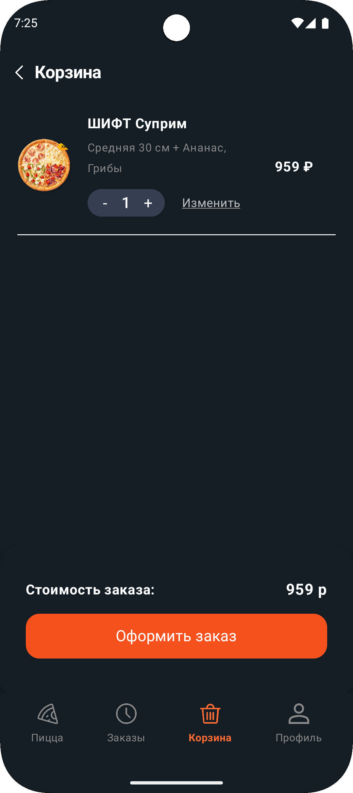
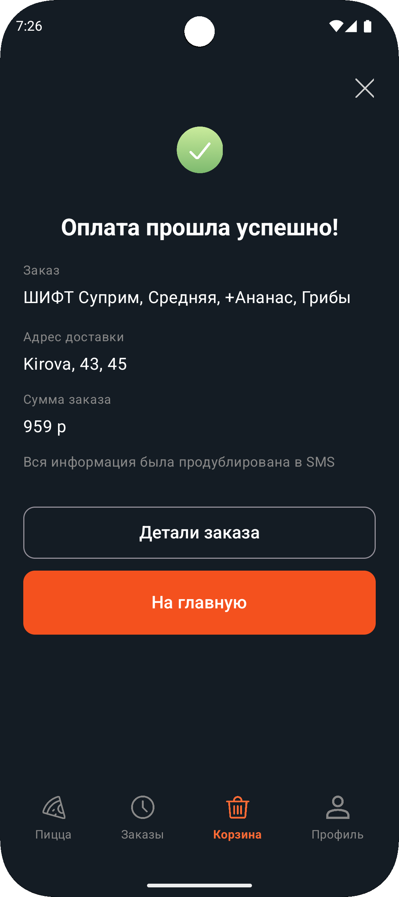
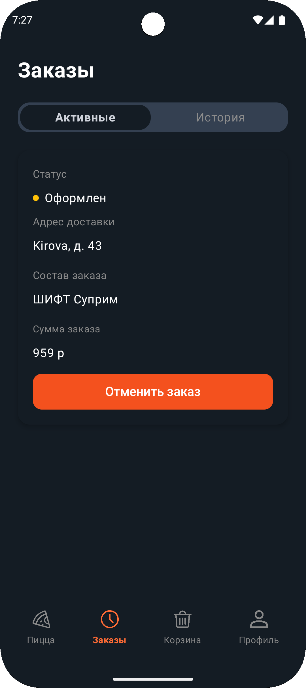
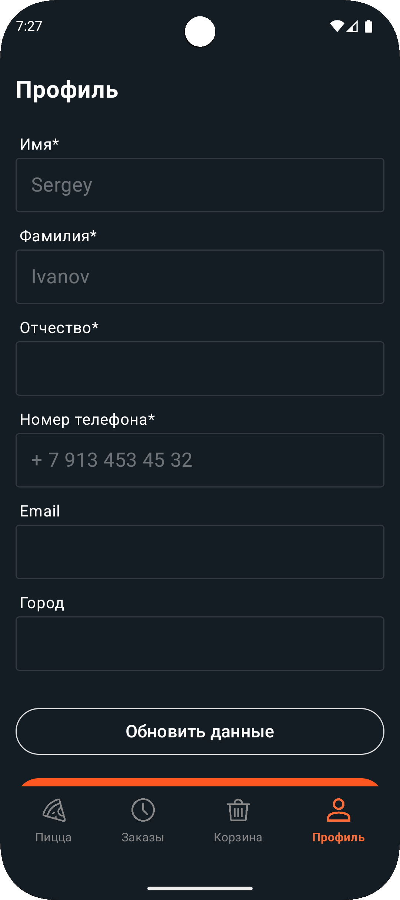

# Pizza Shift 2025

[Figma - Задания ШИФТ интенсив](https://www.figma.com/design/HbwUMBOWcrPBkPTmRPYwor/%D0%97%D0%B0%D0%B4%D0%B0%D0%BD%D0%B8%D1%8F-%D0%A8%D0%98%D0%A4%D0%A2-%D0%B8%D0%BD%D1%82%D0%B5%D0%BD%D1%81%D0%B8%D0%B2?node-id=13419-18771&t=jQSm8CokFSeAEP0e-0)

## 📱 Скриншоты

### ☀️ Светлая тема

  
    
  
  
  
  
  
  

### 🌙 Тёмная тема

  
  
  
  
  
  
  
  

## 📱 Описание

Pizza Shift 2025 - это проект летнего интенсива от компании ШИФТ. Самое ценное наверно тут больше не реализованный проект, а само участие и code review. Было интересно, вообщем.
